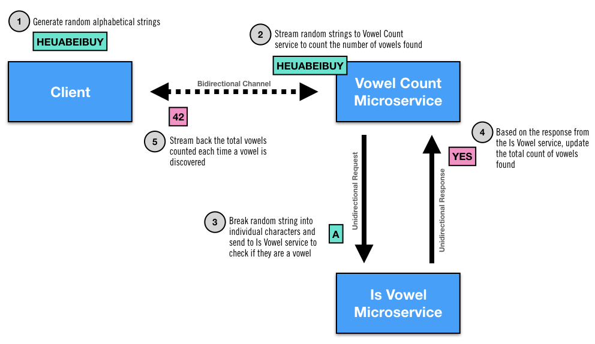

# springboot-demo
An example of how easy it is to orchestrate interactions between multiple [Spring Boot](https://spring.io/projects/spring-boot) microservices using [Netifi Proteus](https://www.netifi.com).

The example works as follows:

1. The client generates random alphabetic strings.
2. The client streams the randomly generated strings to the vowelcount microservice over a bidirectional channel.
3. The vowelcount microservice splits the incoming strings into a stream of individual characters which it then sends one by one to the isvowel microservice using request/reply semantics.
4. The isvowel microservice determines if the character is a vowel and sends back an appropriate boolean response to the vowelcount microservice.
5. If a vowel was identified by the isvowel microservice, the vowelcount microservice increments its internal vowel counter and streams a message to the client with the latest vowel count.

## Project Structure
This example project is structured as follows:

* [client](client) - Client that streams random strings to VowelCount service
* [isvowel-idl](isvowel-idl) - Service contract exposed by the IsVowel service
* [isvowel-service](isvowel-service) - IsVowel service implementation
* [vowelcount-idl](vowelcount-idl) - Service contract exposed by the VowelCount service
* [vowelcount-service](vowelcount-service) - VowelCount service implementation

## Prerequisites
This example requires that you have a running Proteus broker.

You can pull the latest Proteus Broker from DockerHub using the following command:

        $ docker pull netifi/proteus

Start the Proteus Broker by running the following command:

        $ docker run -p 8001:8001 -p 7001:7001 -e BROKER_SERVER_OPTS='-Dnetifi.authentication.0.accessKey=3006839580103245170 -Dnetifi.authentication.0.accessToken=SkOlZxqQcTboZE3fni4OVXVC0e0=' netifi/proteus

## Running the Example
TODO

## Bugs and Feedback
For bugs, questions, and discussions please use the [Github Issues](https://github.com/netifi-proteus/proteus-spring/issues).
